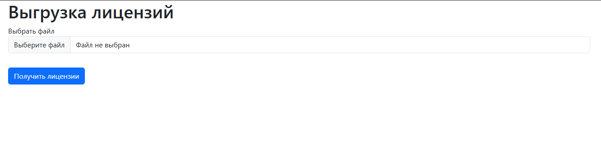

#### Версия php 8.4

#### Для развертывания использовал Symfony CLI: https://symfony.com/download

#### Запуск локального сервера ```symfony server:start```

#### Основная логика парсинга находится в данном классе: ```src/Service/LicenseService.php```
